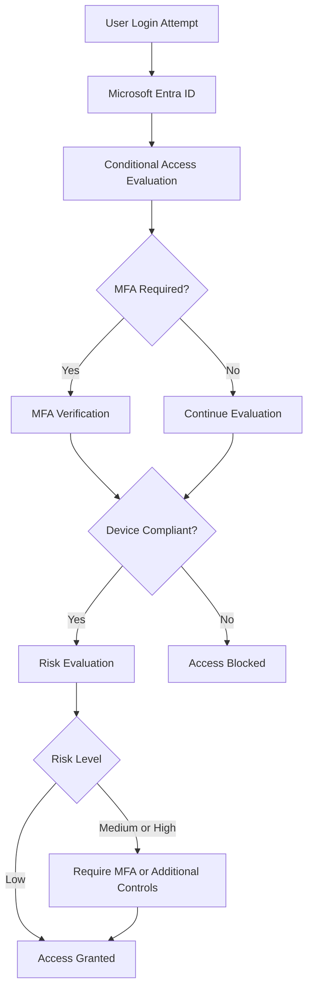
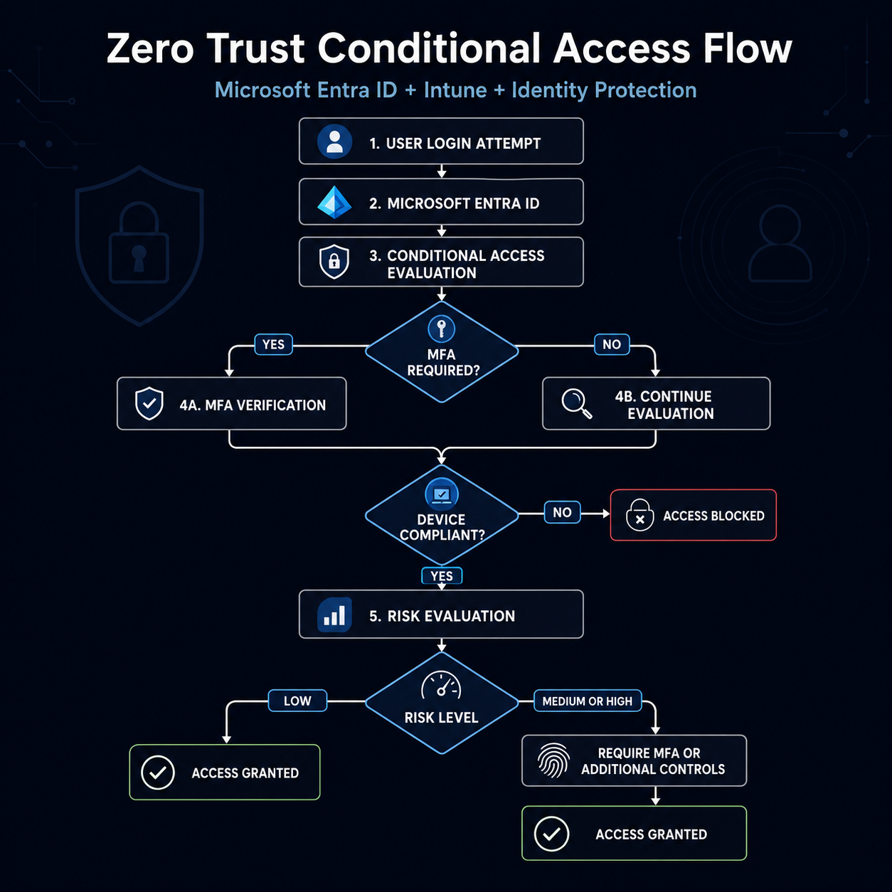
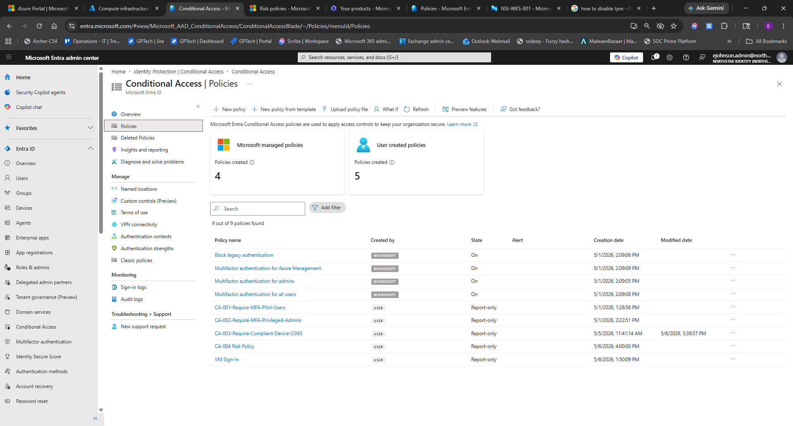
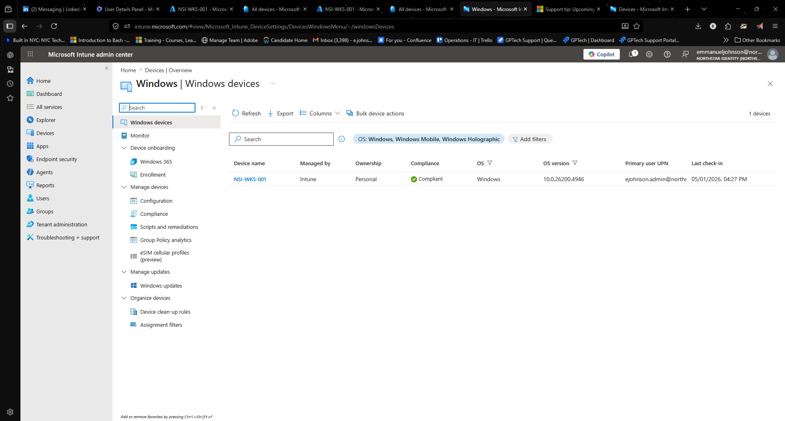
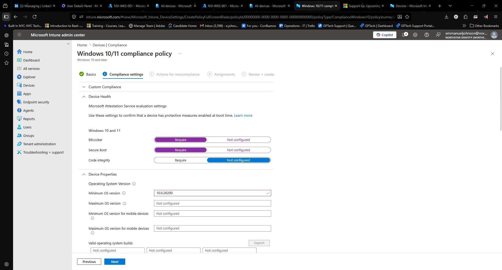
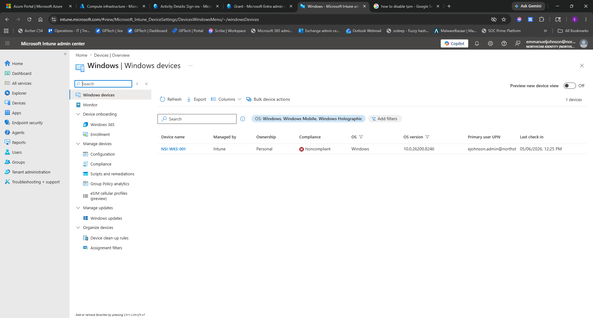
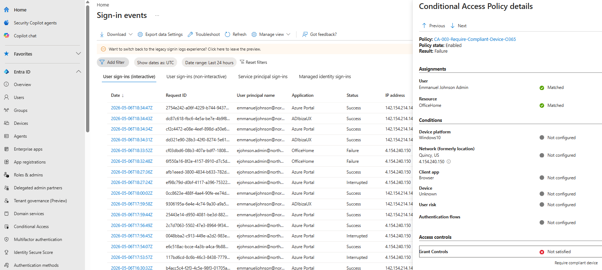
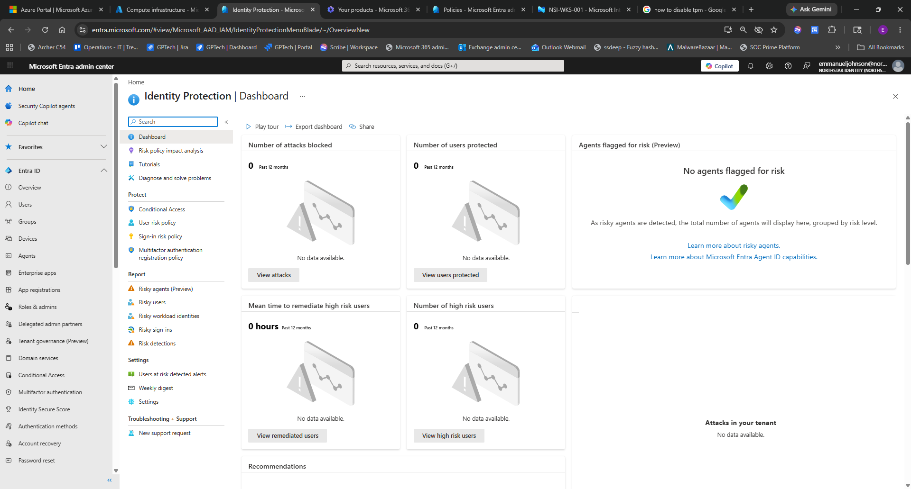

# 🔐 Azure Zero Trust Conditional Access Implementation

## 🎯 Project Goal
This project demonstrates the implementation and validation of a Zero Trust access control model using Microsoft Entra ID, Microsoft Intune, and Conditional Access policies.

The objective was to enforce secure access by requiring:
- Verified user identity (Multi-Factor Authentication)
- Trusted and compliant devices
- Risk-based authentication controls

All policies were tested and validated through real sign-in scenarios.

---

## 📌 Overview
This project simulates a real-world enterprise environment where access to cloud resources is controlled using identity, device posture, and behavioral risk signals.

A layered Conditional Access strategy was designed, implemented, and validated to ensure only secure and compliant entities are granted access.

---

## 🧠 Key Concepts Implemented
- Multi-Factor Authentication (MFA)
- Device Compliance Enforcement (Microsoft Intune)
- Risk-Based Conditional Access (Microsoft Entra Identity Protection)
- Legacy Authentication Blocking
- Break-Glass Account Strategy
- Conditional Access Policy Design and Testing
- Sign-in Log Analysis and Troubleshooting

---

## 🛠 Technologies Used
- Microsoft Entra ID (Azure AD)
- Microsoft Intune
- Conditional Access Policies
- Identity Protection (P2)
- Azure Virtual Machines
- Azure Virtual Network
- Network Security Groups (NSGs)
- Microsoft 365 Admin Center
- Entra Sign-in Logs

---

## 🧱 Access Flow Architecture

The diagram below provides a visual summary of the Zero Trust access decision flow implemented in this project.

## ⚙️ Conditional Access Policies

| Policy Name | State | Purpose |
|------------|------|--------|
| CA-001-Require-MFA-Pilot-Users | Report-only | Validate MFA enforcement for pilot users |
| CA-002-Require-MFA-Privileged-Admins | Report-only | Protect privileged accounts |
| CA-003-Require-Compliant-Device-O365 | Enabled | Enforce device compliance for Microsoft 365 access |
| CA-004-Risk-Based-MFA | Report-only | Evaluate risk-based authentication |
| Microsoft Managed Policies | Enabled | Baseline security (MFA + legacy auth block) |

---

## 💻 Intune Compliance Baseline

A Windows compliance policy was created to enforce minimum security standards.

### Compliance Requirements
- Firewall enabled
- Antivirus enabled
- TPM enabled
- Secure Boot enabled
- BitLocker evaluated
- General device security posture validated

---

## 🧪 Testing & Validation

### ✅ Scenario 1: Compliant Device Access
- Device enrolled into Intune
- Device marked compliant
- MFA completed successfully
- Access to Microsoft 365 granted  

**Result:** Access Allowed

---

### ❌ Scenario 2: Non-Compliant Device Block
- TPM disabled on test VM  
- Device marked Non-Compliant in Intune  
- Attempted sign-in to Microsoft 365  

**Result:** Access Blocked  

**Validation:**
- Conditional Access policy triggered  
- Grant control (Require compliant device) failed  
- Sign-in logs confirmed enforcement  

---

### 🔍 Scenario 3: Conditional Access Logic Validation

During testing, policy behavior was evaluated to confirm correct enforcement logic.

**Key Finding:**
- If policies are configured to require “one of the selected controls,” access may be granted if MFA succeeds even when device compliance fails  
- Proper configuration is required to enforce true Zero Trust behavior  

---

### 🧠 Scenario 4: Risk-Based Authentication

A risk-based Conditional Access policy was created using Microsoft Entra Identity Protection.

### Configuration
- Target: All users  
- Risk level: Medium and High  
- Control: Require MFA  
- Mode: Report-only  

### Validation Approach
- Tested multiple sign-in attempts  
- Reviewed Identity Protection dashboard  
- Analyzed sign-in logs  

**Note:**  
Due to limitations in simulating real-time identity risk in a lab environment, validation was performed using report-only evaluation and telemetry analysis.

---

## 📊 Key Findings
- Conditional Access policies should be tested in report-only mode before enforcement  
- Break-glass accounts are critical to prevent tenant lockout  
- Device compliance adds a strong security layer beyond identity verification  
- Policy logic (Require ALL vs ONE control) significantly impacts security outcomes  
- Sign-in logs are essential for troubleshooting and validation  
- Risk-based policies introduce adaptive security based on behavior  

---

## 📸 Evidence

### Zero Trust Access Flow

### Conditional Access Policy Framework

### Intune Managed Device

### Compliance Policy Baseline

### Non-Compliant Device

### Conditional Access Enforcement Failure

### Identity Protection / Risk-Based Conditional Access

---

## 🚀 Future Improvements
- Integrate Microsoft Sentinel for monitoring and alerting  
- Develop KQL queries for failed Conditional Access events  
- Implement geo-location based access restrictions  
- Expand Intune configuration profiles  
- Deploy endpoint security baselines  
- Automate compliance remediation with scripts  

---

## 👨🏽‍💻 Author

**Emmanuel Johnson**  
IT Support Specialist  
Aspiring Systems Administrator | Cybersecurity Professional  
